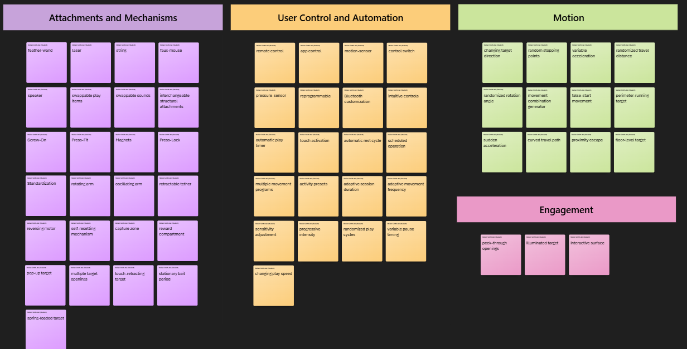
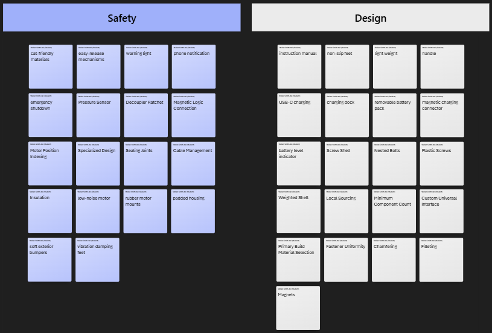
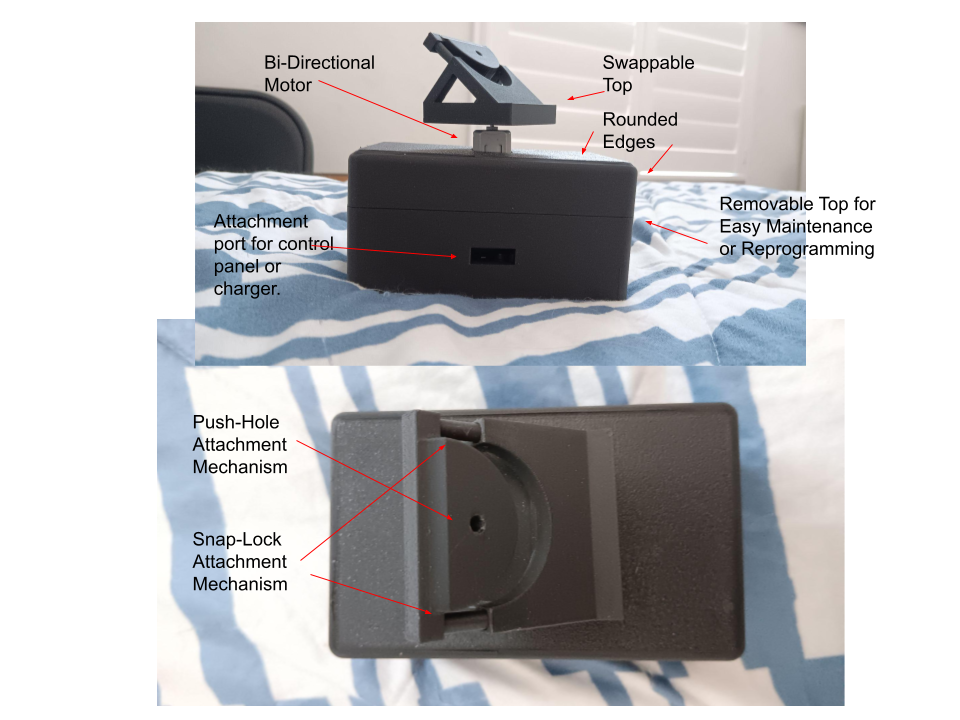

## Intro/overview

The goal of this project is to develop an interactive cat toy that keeps cats engaged through movement, chasing, and pouncing behaviors. The design focuses on creating unpredictable and adjustable motion so the toy remains interesting during repeated use while also being safe and easy for the owner to operate.

The primary audience for the product is cat owners who want a way to provide their cats with physical activity and mental stimulation, especially when they are unable to actively play with them. The concepts developed during this ideation process use the user needs and product requirements identified in previous assignments to explore different ways the final product could meet those goals.

## Generating Ideas

For each user need and product requirement, brainstorm 5 different product features that could be used to satisfy that requirement.

|                   requirement / need | feature | detail |
| -----------------------------------: | :-----: | :----- |
| The device is fun for cats. | feather-wand | the device provides semi-realistic play target |
| The device is fun for cats. | laser | the device simulates a potential hunting target |
| The device is fun for cats. | string | the device provides semi-realistic play target |
| The device is fun for cats. | faux-mouse | the device provides a realistic hunting target |
| The device is fun for cats. | speaker | the device simulates the sounds of a potential hunting target |
| The device allows the level of stimulation to be adjusted. | remote control | the device can be controlled remotely |
| The device allows the level of stimulation to be adjusted. | app control | the device can be controlled via an app |
| The device allows the level of stimulation to be adjusted. | motion-sensor | the device detects a cat's activity level |
| The device allows the level of stimulation to be adjusted. | control switch | the device can change stimulation based on switch input |
| The device allows the level of stimulation to be adjusted. | pressure-sensor | the device can change stimulation based on pressure input |
| The device is easy for the owner to set up. | instruction manual | the device comes with a detailed instruction manual regarding set up |
| The device is easy for the owner to set up. | non-slip feet | the device will not slip when placed on hard surfaces |
| The device is easy for the owner to set up.. | light weight | the device will be easy to pick up and carry |
| The device is easy for the owner to set up. | handle | the device will be easy to pick up and carry |
| The device is easy for the owner to set up. | intuitive controls | the device will respond in a notable way when interacted with |
| The device can be customized for different play preferences. | swappable play items | the device will have mechanisms allowing the play item to be swapped |
| The device can be customized for different play preferences. | reprogrammable | the device will be able to be reprogrammed easily |
| The device can be customized for different play preferences. | swappable sounds | the device will have mechanisms allowing any sounds emitted to be changed |
| The device can be customized for different play preferences. | interchangeable structural attachments | the device will be able to attach to different surfaces |
| The device can be customized for different play preferences. | Bluetooth customization | the device will be able to be customized through Bluetooth |
| The device is safe to operate around cats. | cat=friendly materials | the device will be composed of non-toxic materials |
| The device is safe to operate around cats. | easy-release mechanisms | the device will be designed so cats can free themselves if caught |
| The device is safe to operate around cats. | warning light | the device will light up if unsafe conditions occur |
| The device is safe to operate around cats. | phone notification | the device will send a notification if stuck |
| The device is safe to operate around cats. | emergency shutdown | the device will cease all movement if caught |
| The device maintains a cat's interest. | randomized play cycles | the device changes its play sequence between sessions |
| The device maintains a cat's interest. | variable pause timing | the device pauses for different amounts of time during play |
| The device maintains a cat's interest. | changing target direction | the play target moves in different directions throughout a session |
| The device maintains a cat's interest. | multiple movement programs | the device can select between several programmed movement patterns |
| The device maintains a cat's interest. | changing play speed | the device varies its speed throughout the play session |
| The device provides varied movement patterns. | rotating arm | the play attachment moves around the device in a circular path |
| The device provides varied movement patterns. | oscillating arm | the play attachment moves back and forth |
| The device provides varied movement patterns. | retractable tether | the play attachment moves toward and away from the device |
| The device provides varied movement patterns. | reversing motor | the motor changes direction during operation |
| The device provides varied movement patterns. | random stopping points | the play attachment stops at different positions before moving again |
| The device can operate without continuous owner interaction. | automatic play timer | the device runs a complete play session automatically |
| The device can operate without continuous owner interaction. | touch activation | the cat can start the device by touching it |
| The device can operate without continuous owner interaction. | automatic rest cycle | the device alternates between active play and rest periods |
| The device can operate without continuous owner interaction. | self-resetting mechanism | the play mechanism automatically returns to its starting position |
| The device can operate without continuous owner interaction. | scheduled operation | the device can begin play at predetermined times |
| The device can operate quietly. | low-noise motor | the device uses a motor designed for quiet operation |
| The device can operate quietly. | rubber motor mounts | rubber isolation reduces vibration transferred to the housing |
| The device can operate quietly. | padded housing | padding reduces sound produced by internal components |
| The device can operate quietly. | soft exterior bumpers | soft material reduces noise when the device contacts furniture or walls |
| The device can operate quietly. | vibration damping feet | the device reduces vibration transferred to the floor |
| The device is rechargeable. | USB-C charging | the device can be charged using a standard USB-C cable |
| The device is rechargeable. | charging dock | the device can be placed on a dock to recharge |
| The device is rechargeable. | removable battery pack | the battery can be removed and charged or replaced |
| The device is rechargeable. | magnetic charging connector | the charging cable connects magnetically for easy attachment |
| The device is rechargeable. | battery level indicator | LEDs display the approximate remaining battery charge |
| The product shall stop powered movement if the mechanism becomes obstructed. | Pressure Sensor | The motor will cease operation upon experiencing unexpected force. |
| The product shall stop powered movement if the mechanism becomes obstructed. | Decoupler Ratchet | A Gear designed to shear when excess force is applied opposite to desired direction |
| The product shall stop powered movement if the mechanism becomes obstructed. | Magnetic Logic Connection | Solder wire to nickel-plated magnets, and stop when disconnected. |
| The product shall stop powered movement if the mechanism becomes obstructed. | Motor Position Indexing | Use optical logic to detect incorrect spatial movement |
| The product shall stop powered movement if the mechanism becomes obstructed. | Specialized Design | Occam's Razor. Design an unobstructable mechanism. |
| The product shall allow access to internal components for repair or maintenance. | Magnets | Attach the shell pieces with strong magnets that can be pulled apart. |
| The product shall allow access to internal components for repair or maintenance. | Screw Shell | Two halves of a shell screw into each other. |
| The product shall allow access to internal components for repair or maintenance. | Nested Bolts | Attach shell pieces with countersunk nuts/bolts. |
| The product shall allow access to internal components for repair or maintenance. | Plastic Screws | Attach shell pieces by pressure-threading screws. |
| The product shall allow access to internal components for repair or maintenance. | Weighted Shell | One hemisphere open on the bottom, with weights to prevent it from flipping. |
| The product shall use commercially available components where practical. | Local Sourcing | Design around parts that you can find at a local hardware store. |
| The product shall use commercially available components where practical. | Minimum Component Count | Make custom pieces require as few assembly steps as possible. |
| The product shall use commercially available components where practical. | Custom Universal Interface | Design custom pieces to be durable and not require additional fasteners |
| The product shall use commercially available components where practical. | Primary Build Material Selection | Use designs that are not dependent on 3D printing for fabrication. |
| The product shall use commercially available components where practical. | Fastener Uniformity | Design that uses fasteners of the same type and dimensions universally. |
| The product shall not expose sharp edges or present shock hazards during use. | Chamfering | Edges will be chamfered at 45 degrees or greater |
| The product shall not expose sharp edges or present shock hazards during use. | Filleting | Edges will be filleted to remove any corners |
| The product shall not expose sharp edges or present shock hazards during use. | Sealing Joints | Any wire joint will either be a removable socket, heat-shrunk, and/or hot glued. |
| The product shall not expose sharp edges or present shock hazards during use. | Cable Management | Any cabling should be firmly mounted to a surface to resist damage. |
| The product shall not expose sharp edges or present shock hazards during use. | Insulation | Electrical components will have enough insulation/enameling to resist wear. |
| The product shall support interchangeable play attachments | Screw-On | Parts connect via embedded threads. |
| The product shall support interchangeable play attachments | Press-Fit | Attachments work like a shop-vac. |
| The product shall support interchangeable play attachments | Magnets | Magnetic Attachment |
| The product shall support interchangeable play attachments | Press-Lock | Components have a male and female end with a locking mechanism (think suitcase or telescopic table legs) |
| The product shall support interchangeable play attachments | Standardization | Whatever the mechanism, it should be a universal interface. |
| The device provides engaging play. | peek-through openings | the play elements periodically appear through different openings to attract the cat |
| The device provides engaging play. | capture zone | the device includes an area where the cat can temporarily catch the moving target |
| The device provides engaging play. | reward compartment | successful interaction can release a small toy or treat |
| The device provides engaging play. | illuminated target | a light integrated into the play element makes the target more visually engaging |
| The device provides engaging play. | interactive surface | sections of the device move or react when touched by the cat |
| The device encourages chasing behavior. | perimeter-running target | the target travels around the outside of the device for the cat to chase |
| The device encourages chasing behavior. | sudden acceleration | the target rapidly accelerates to imitate prey escaping |
| The device encourages chasing behavior. | curved travel path | the target follows curved paths to imitate natural prey movement |
| The device encourages chasing behavior. | proximity escape | the target moves away when the cat approaches |
| The device encourages chasing behavior. | floor-level target | the target remains close to the floor while moving |
| The device encourages pouncing behavior. | pop-up target | a target quickly emerges from the housing and then retracts |
| The device encourages pouncing behavior. | multiple target openings | the target can appear from several different locations on the device |
| The device encourages pouncing behavior. | touch-retracting target | the target retracts when the cat strikes it |
| The device encourages pouncing behavior. | stationary bait period | the target remains still before suddenly beginning to move |
| The device encourages pouncing behavior. | spring-loaded target | the target moves when struck and springs back into position |
| The device provides unpredictable movement. | variable acceleration | the target accelerates and decelerates at different rates |
| The device provides unpredictable movement. | randomized travel distance | each movement covers a different distance |
| The device provides unpredictable movement. | randomized rotation angle | the mechanism rotates by different angles for each movement |
| The device provides unpredictable movement. | movement combination generator | the device combines several basic movements into different sequences |
| The device provides unpredictable movement. | false-start movement | the target begins moving, briefly stops, and then continues in an unexpected direction |
| The device accommodates cats with different activity levels. | activity presets | the owner can select low-, medium-, or high-activity play settings |
| The device accommodates cats with different activity levels. | adaptive session duration | play-session length changes based on how actively the cat interacts |
| The device accommodates cats with different activity levels. | adaptive movement frequency | the device changes how frequently the target moves based on cat interaction |
| The device accommodates cats with different activity levels. | sensitivity adjustment | the owner can change how much cat interaction is required to trigger the device |
| The device accommodates cats with different activity levels. | progressive intensity | the device begins with low activity and gradually increases stimulation during play |

## Step Three
Initial Sorting of Ideas

Add your context and tables

## Step Four
Concept #1: Multi-Toy

This concept argues that choice is elegance. It's primary feature is the customizability of the toy, with a built-in swapping mechanism, allowing different cat toys to be placed on top of a rotating motor. This primarily allows for the use of either feather-wand or laser toys, though it can be modified to fit other styles of toy. Additionally, it features two external ports, one of which can be used to recharge the device, and the other can be used to set up a preferred control mechanism. The primary control panel mechanism that the product comes with will feature a pressure sensor, simple switch, and microphone. This will allow for both touch and remote activation, with the option to force the system to turn on/off. The system will have an auto-run timer and sticky-vibration lessening feet.

Used concepts:
feather-wand, laser, speaker, swappable play items, interchangeable structural attachments, rotating arm, reversing motor, automatic rest cycle, remote control, control switch, pressure-sensor, automatic play timer, touch activation, curved travel path, floor-level target, changing target direction, Cable Management, cat-friendly materials, soft exterior bumpers, vibration damping feet, removable battery pack, instruction manual, Weighted Shell, non-slip feet, charging dock, light weight, Chamfering.

## Step Five 

Describe, in one page (an equivalent length in word would be single spaced, 12pt times new roman font)

Describe, in one page (an equivalent length in word would be single spaced, 12pt times new roman font)
