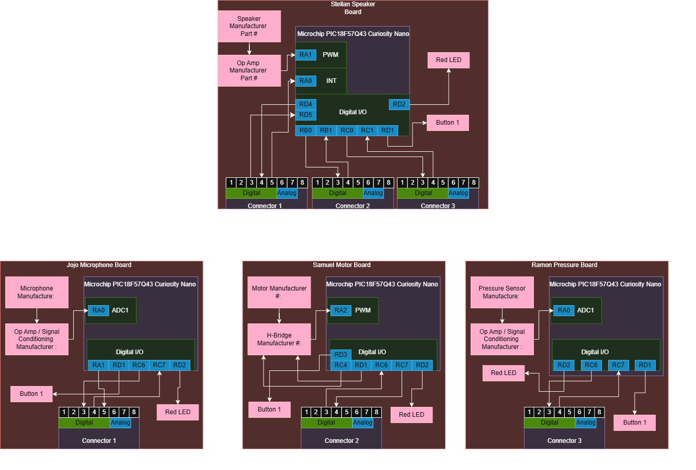

## Introduction
The team block diagram shows how each team member's part of the project connects and works together. It shows the main components, microcontrollers, connector pin assignments, and the analog and digital signals used between each board.

## System Overview

The project is split into four main parts, with each team member responsible for a different part of the system:

* **Stellan:** Speaker
* **Jojo:** Microphone
* **Samuel:** Motor
* **Ramon:** Pressure Sensor

## Images

 
**Figure 1:** Team Block Diagram
[Block Diagram]([https://www.github.com](https://github.com/EGR304-2026-F-203/EGR304_Team203.github.io/blob/main/docs/Appendix/Team_203_Block_Diagram.drawio))

## Results

The team block diagram shows how the four boards connect through the ribbon cable connectors. Each board uses a PIC18F57Q43 Curiosity Nano to control its part of the system. The diagram also shows the pin assignments and the analog and digital signals used between the boards.

## Conclusions and Future Work
The block diagram gives the team a clear layout for how each part of the system will connect and communicate. As the project continues, the diagram can be updated if components, pin assignments, or connections change.
## External Links

[example link to idealab](https://idealab.asu.edu)

## Results

1. Numbered Point 1
1. Numbered Point 2
1. Numbered Point 3

## Conclusions and Future Work

## External Links

[example link to idealab](https://idealab.asu.edu)

## References

Arizona State University, EGR 304. "Team Block Diagram." Embedded Systems Design.
